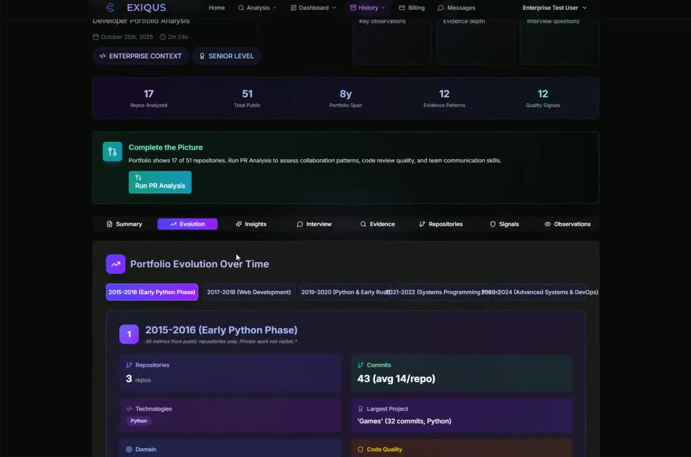

# Exiqus

[](https://www.gnu.org/licenses/agpl-3.0)
[]()
[]()
[]()

**Evidence-based developer evaluation from GitHub — no scores, no ratings, no verdicts.**

Exiqus analyzes a developer's public GitHub work at three levels — a
single repository deep-dive, their entire public portfolio, and their
pull-request contributions to other projects — and produces reports
built entirely from observable engineering evidence: testing practices,
documentation quality, architectural patterns, commit communication,
collaboration style, growth signals. It never reduces a person to a
number.

## See It Running

[](frontend/public/demo-video.mp4)

**[▶ Watch the full walkthrough (2m 38s)](frontend/public/demo-video.mp4)**

A recording of the production application, which is what you get when
you run this repo locally: kicking off a portfolio analysis, the
Candidate Intelligence Hub, portfolio evolution over time, the evidence
and observations tabs, and the generated interview questions with their
supporting evidence. Everything shown is in this repository — there is
no hosted service behind it.

## Why I Built This

Hiring is broken. Resumes exaggerate, leetcode measures the wrong
things, and the strongest evidence of how someone actually builds
software — their code, sitting in plain sight on GitHub — mostly goes
unread.

I built Exiqus as a solo founder to fix that: a production SaaS that
turned repositories into structured, evidence-based assessments a
recruiter could act on. The commercial product has wound down, so I'm
open-sourcing the whole platform — backend, frontend, billing, the lot —
for anyone who wants to use it, learn from it, or build on it.

## The Philosophy: Evidence, Not Judgment

Every design decision follows one rule: **observations over
assessments**.

- ✅ "2,022 tests in the repository, run in CI on every push"
- ✅ "Commit messages consistently explain *why*, not just *what*"
- ❌ ~~"Code quality: 87/100"~~
- ❌ ~~"Verdict: HIRE"~~

Reports contain evidence patterns, interview questions grounded in that
evidence, areas to explore, explicit data limitations, and confidence
expressed as an *explanation* — never a percentage. Anti-hallucination
safeguards give minimal/empty repositories an early exit instead of
invented insights.

## What It Does

Three analysis modes:

- **Repository deep-dive** — evidence extraction from a single repo:
  code structure, testing, documentation, commit patterns, project
  organization
- **Portfolio analysis** — a developer's whole public GitHub profile:
  patterns across repositories, skill breadth, growth trajectory over
  time
- **PR contribution analysis** — pull requests to other projects:
  collaboration style, code-review dialogue, how they work in someone
  else's codebase

Plus:

- **Context-aware analysis** — the same work reads differently for a
  startup, enterprise, agency, or open-source role
- **AI-powered insights** — Claude-generated observations, each tied to
  specific supporting evidence
- **Interview question generation** — questions that reference what the
  candidate actually built
- **Tiered analysis depth** — configurable tiers (see
  `src/github_analyzer/core/tier_config.py`) from template-based to
  deep multi-pass AI analysis
- **Full SaaS scaffolding** — auth, Stripe billing, usage metering,
  admin portal, rate limiting; useful as a reference even if you only
  self-host the analyzer

## Architecture

```
┌─────────────┐     ┌──────────────────┐     ┌────────────┐
│  Next.js 15 │────▶│  FastAPI backend │────▶│ PostgreSQL │
│  frontend   │     │  (Python 3.11)   │     └────────────┘
└─────────────┘     │                  │     ┌────────────┐
                    │  evidence engine │────▶│   Redis    │
                    │  + Claude API    │     └────────────┘
                    └──────────────────┘
```

PostgreSQL everywhere — local dev, tests, and production run the same
database, so what passes locally behaves identically when deployed.

- `src/github_analyzer/core/` — evidence extraction, classification,
  analysis strategies, report generation
- `src/github_analyzer/ai/` — Claude integration, hardened parsers,
  anti-hallucination prompts
- `src/github_analyzer/api/` — FastAPI routes, auth, middleware
- `src/github_analyzer/billing/` — Stripe subscriptions, webhooks,
  usage metering
- `frontend/` — Next.js app with the Exiqus design system

Quality bar: 2,000+ tests, mypy strict, ruff (lint + format + security rules), and
a CI pipeline that runs all of it.

## Quick Start

### Prerequisites

- Python 3.11+, [Poetry](https://python-poetry.org/)
- Node.js 20+
- Docker (for the local PostgreSQL database and the test suite)
- An [Anthropic API key](https://console.anthropic.com/) and a GitHub token

### Backend

```bash
poetry install --with dev
cp .env.production.example .env      # fill in your keys
docker compose up -d postgres redis  # local database + cache
poetry run uvicorn github_analyzer.api.main:app --reload
```

### Frontend

```bash
cd frontend
npm install
npm run dev    # http://localhost:3000
```

### Full stack via Docker

```bash
cp docker-compose.env.example .env   # fill in secrets
docker compose up
```

### Run the tests

```bash
poetry run pytest tests/
```

Tests run against a real PostgreSQL instance spun up automatically via
[testcontainers](https://testcontainers-python.readthedocs.io/) — you
only need Docker running. To point tests at an existing database
instead (e.g. in CI), set `TEST_DATABASE_URL`.

## Contributing

Contributions are welcome — see [CONTRIBUTING.md](CONTRIBUTING.md) for
setup, quality gates, and the evidence-based ground rules (short
version: PRs that add scores or verdicts won't be merged).

Security issues: see [SECURITY.md](SECURITY.md).

## License

Exiqus is licensed under the [GNU AGPL-3.0](LICENSE).

You can use, modify, and distribute it freely. If you run a modified
version as a network service, the AGPL requires you to release your
complete source code under the same license — that's deliberate: this
project is a gift to the commons, not free R&D for closed products.

Third-party dependency licenses are listed in
[THIRD-PARTY-NOTICES.md](THIRD-PARTY-NOTICES.md).

---

Built solo, with care, by [@salimc93](https://github.com/salimc93).
